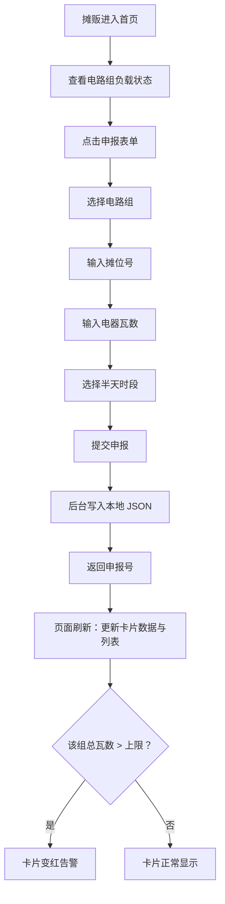

## 1. 产品概述

江滩周末市集用电申报系统——为市集摊贩提供线上用电申报入口，帮助管理方实时监控甲/乙/丙三组电路负载状况，防止超负荷运行。

- 目标用户：市集摊贩（申报用电）、管理方（监控负载）
- 核心价值：替代纸质/口头登记，实现用电申报数字化，超载即时告警

## 2. 核心功能

### 2.1 用户角色

| 角色 | 使用方式 | 核心权限 |
|------|----------|----------|
| 摊贩 | 无需注册，直接使用 | 填写申报表单、查看电路负载 |
| 管理方 | 同上 | 查看三组电路详情、筛选申报记录 |

### 2.2 功能模块

1. **首页仪表盘**：三组电路负载卡片 + 申报表单 + 侧栏申报列表
2. **申报表单**：选电路组、摊位号、电器瓦数、半天时段

### 2.3 页面详情

| 页面名称 | 模块名称 | 功能描述 |
|----------|----------|----------|
| 首页仪表盘 | 电路组卡片 ×3 | 显示已申报总瓦数、上限瓦数、负载百分比进度条；超载变红 |
| 首页仪表盘 | 申报表单 | 选择电路组（甲/乙/丙）、输入摊位号、输入电器瓦数、选择半天（上午/下午）；提交后返回申报号 |
| 首页仪表盘 | 侧栏申报列表 | 展示所选电路组的全部申报记录（申报号、摊位号、瓦数），支持按半天筛选 |

## 3. 核心流程

## 4. 用户界面设计

### 4.1 设计风格

- **主色调**：暖琥珀色（#D97706）作为品牌色，深灰（#1C1917）底色，搭配奶油白（#FAFAF9）卡片
- **按钮风格**：圆角（8px），品牌色填充，hover 略微提亮
- **字体**：标题用 Noto Serif SC（衬线，市集文书感），正文用 Noto Sans SC
- **布局风格**：左侧主区域（卡片 + 表单），右侧侧栏（申报列表），顶部导航条
- **图标风格**：Lucide 线性图标，简洁实用

### 4.2 页面设计概览

| 页面名称 | 模块名称 | UI 元素 |
|----------|----------|---------|
| 首页仪表盘 | 顶部导航 | 系统标题 + 江滩市集 logo 风格装饰，暖色调 |
| 首页仪表盘 | 电路组卡片 ×3 | 深色卡片背景，品牌色进度条，瓦数数字大号展示，超载时边框+背景变红 |
| 首页仪表盘 | 申报表单 | 浮于卡片区域下方，4 个字段纵向排列，提交按钮品牌色 |
| 首页仪表盘 | 侧栏申报列表 | 右侧固定区域，顶部半天筛选按钮（上午/下午/全部），下方列表项展示申报号/摊位/瓦数 |

### 4.3 响应式

- 桌面优先设计（1920px / 1440px / 1280px）
- 小屏幕下侧栏折叠到主区域下方
- 触控优化：按钮/表单元素最小 44px 可点击区域
