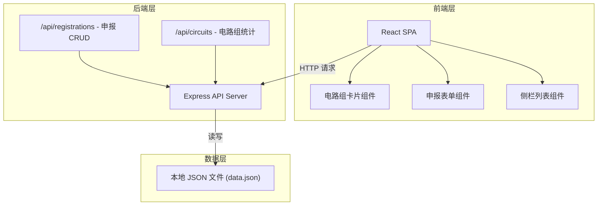
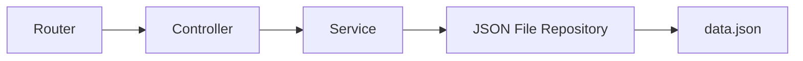
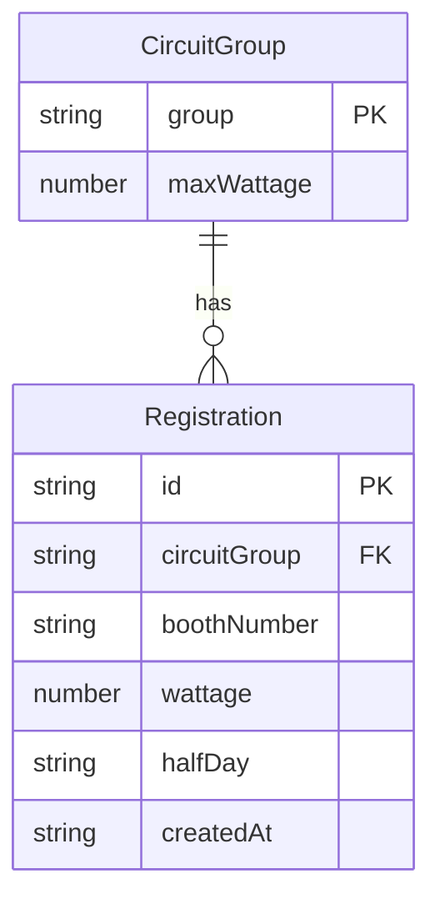

## 1. 架构设计



## 2. 技术说明

- **前端**：React@18 + Tailwind CSS@3 + Vite + Zustand（状态管理）
- **初始化工具**：vite-init（react-express-ts 模板）
- **后端**：Express@4（ESM + TypeScript）
- **数据库**：本地 JSON 文件（data.json），无外部数据库依赖

## 3. 路由定义

| 路由 | 用途 |
|------|------|
| `/` | 首页仪表盘（单页应用，前端路由） |

## 4. API 定义

### 4.1 提交申报

```
POST /api/registrations
Body: { circuitGroup: "甲" | "乙" | "丙", boothNumber: string, wattage: number, halfDay: "上午" | "下午" }
Response: { id: string, ...body, createdAt: string }
```

### 4.2 查询申报列表

```
GET /api/registrations?circuitGroup=甲&halfDay=上午
Response: Registration[]
```

### 4.3 查询电路组统计

```
GET /api/circuits
Response: CircuitStats[]

CircuitStats = {
  group: "甲" | "乙" | "丙",
  totalWattage: number,
  maxWattage: number,
  loadPercent: number,
  overload: boolean
}
```

### 4.4 数据类型定义

```typescript
interface Registration {
  id: string
  circuitGroup: "甲" | "乙" | "丙"
  boothNumber: string
  wattage: number
  halfDay: "上午" | "下午"
  createdAt: string
}

interface CircuitConfig {
  group: "甲" | "乙" | "丙"
  maxWattage: number
}

interface CircuitStats {
  group: "甲" | "乙" | "丙"
  totalWattage: number
  maxWattage: number
  loadPercent: number
  overload: boolean
}
```

## 5. 服务器架构图



## 6. 数据模型

### 6.1 数据模型定义



### 6.2 初始数据

```json
{
  "circuitGroups": [
    { "group": "甲", "maxWattage": 10000 },
    { "group": "乙", "maxWattage": 8000 },
    { "group": "丙", "maxWattage": 6000 }
  ],
  "registrations": []
}
```
